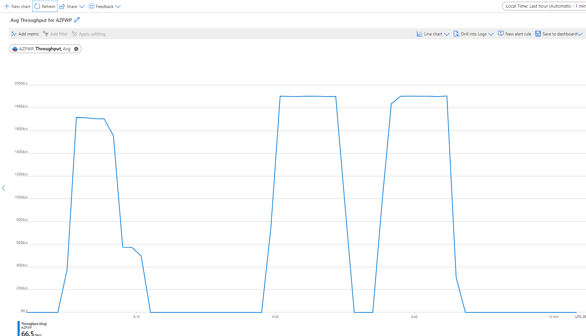

# Secured-VWAN-thourghput-testing
Testing performance of Azure Firewall in Secured VWAN environment

## Overview

This lab will examine the behavior of the Azure Firewall Premium, deployed in the Azure VWAN hub. Two basic tests will be conducted - a combined throughput test of spoke to spoke and a VM to VM test. 

## Topology


## VM to VM via VHUB

It is possible for Standard_D2_V5 to run at 12500Mbps network bandwidth, as stated in https://docs.microsoft.com/en-us/azure/virtual-machines/dv5-dsv5-series. The following results can be observed when iperf3 is run between VMs on different spokes:


| Test | Source | Destination | Transit | Bandwidth |
|-----------------|-----------------|-------------------|------------------|---------------|
| iperf3 -P64 | D2_V5 / Centralus0 | D2_V5 / Centralus1 | Unsecured VWAN Hub | 2.38 Gbps |
| iperf3 -P64 | D2_V5 / Centralus0 | D2_V5 / Centralus1 | Secured VWAN Hub | 12 Gbps |


```
Unsecured VWAN hub
[SUM]   0.00-10.00  sec  2.81 GBytes  2.41 Gbits/sec  23972             sender
[SUM]   0.00-10.00  sec  2.77 GBytes  2.38 Gbits/sec                  receiver

Secured VWAN hub ( Azure Firewall Premium )
[SUM]   0.00-10.00  sec  13.9 GBytes  12.0 Gbits/sec  51463             sender
[SUM]   0.00-10.00  sec  13.9 GBytes  11.9 Gbits/sec                  receiver
```

## Combined traffic via Secured VHUB

As a result of deploying VMSS in hub and spokes, we can generate 160Gbps through Azure Firewall. 




## Route table in Spoke 

Route table in spoke in unsecured vwan hub

```
Source	                        State	Address Prefixes	Next Hop Type	Next Hop IP Address
Default	                        Active	10.0.0.0/16	        Virtual network	
Default	                        Active	10.100.0.0/24	    VNet peering	
Virtual network gateway	        Active	10.1.0.0/16	        Virtual network gateway	20.112.202.85
Virtual network gateway	        Active	10.2.0.0/16	        Virtual network gateway	20.112.202.85
Virtual network gateway	        Active	10.3.0.0/16	        Virtual network gateway	20.112.202.85
Default	                        Active	0.0.0.0/0	        Internet	
Default	                        Active	10.0.0.0/8	        None	
```

Routing table in secured vwan hub
```
Source	                    State	Address Prefixes	Next Hop Type	Next Hop IP Address	User Defined Route Name
Default	                    Active	10.0.0.0/16	        Virtual network		
Default	                    Active	10.100.0.0/24	    VNet peering		
Virtual network gateway	    Active	10.2.0.0/16	        Virtual network gateway	20.112.202.85	
Virtual network gateway	    Active	10.0.0.0/8	        Virtual network gateway	10.100.0.132	
Virtual network gateway	    Active	172.16.0.0/12	    Virtual network gateway	10.100.0.132	
Virtual network gateway	    Active	192.168.0.0/16	    Virtual network gateway	10.100.0.132	
Virtual network gateway	    Active	10.3.0.0/16	        Virtual network gateway	20.112.202.85	
Default	                    Active	0.0.0.0/0	        Internet		
```

## Lab deployment 


The entire lab infrastructure is built with az cli, with the exception of securing spoke to spoke traffic. 

Source is located [here](/infrastructure/infrastructure.sh)

Execute as follows : 

Define the variables ( mostly the regions )
```
function parameters {
    export rg="VWAN001"
    export vwan_name="VWAN"

    export location0="centralus"
    export location1="eastus"

    export vhub0_name="vhub0-${location0}"
    export vhub1_name="vhub1-${location1}"
}
```
Create RG
```
az group create --name ${rg} --location ${location0}
```
Create VWAN, VNET, Subnets, NSG
```
infra_create
```
Create VMs ( jump servers )
```
vm_create
```
Update ssh key on jump servers
```
key_update
```
Check connectivity
```
connectivity_check
```
Create Firewall
```
firewall_create
```
Create Stroage account for VMSS syncronization
```
storage_create
```
Secure Spoke to Spoke traffic ( via portal )

Create VMSS
```
vmss0_create
vmss1_create
```
Scale VMSS
```
vmss_scale 20
```


